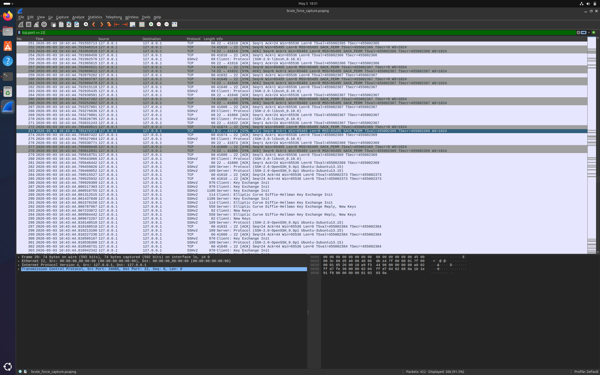
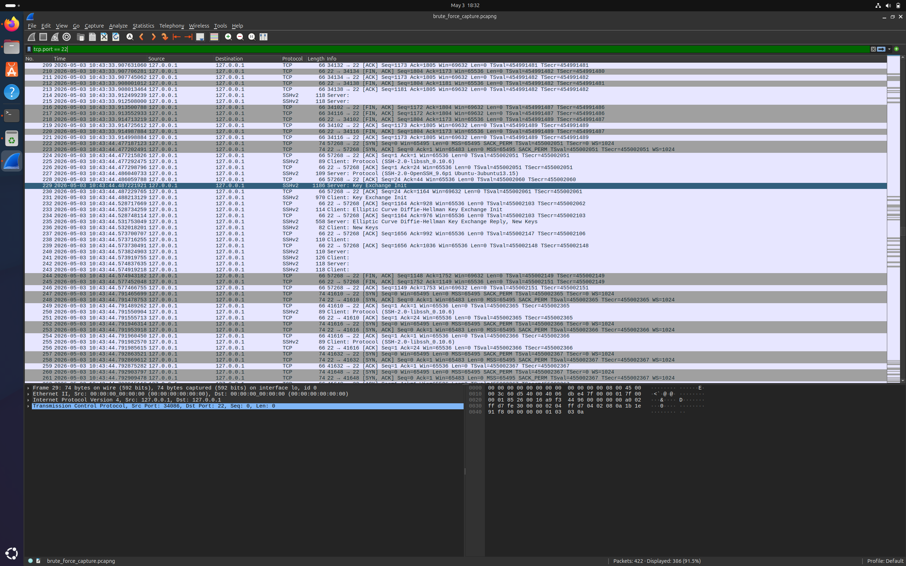
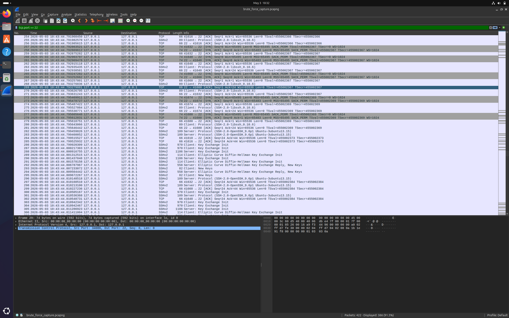
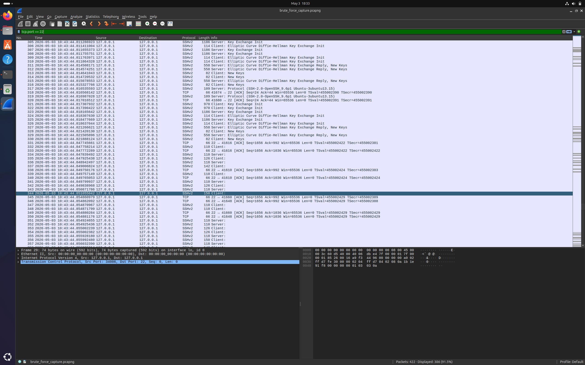
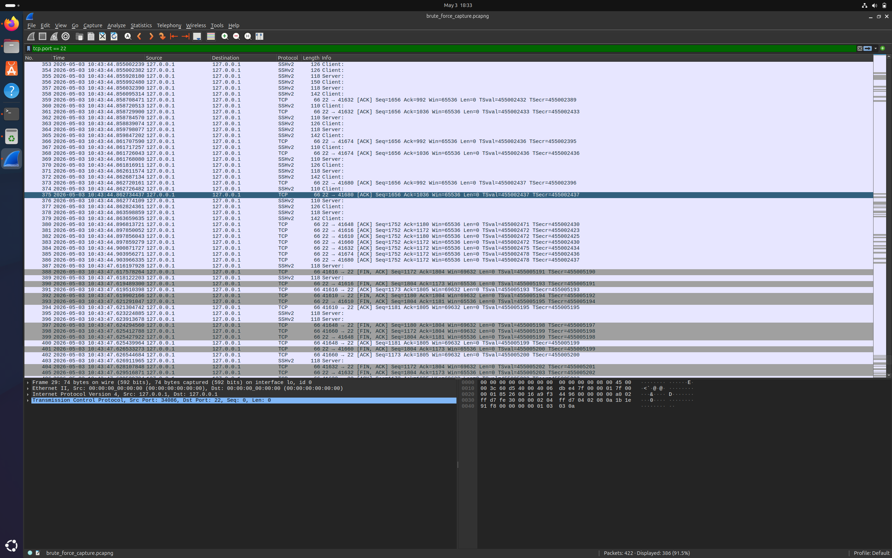

# SSH Brute Force Attack Detection Lab

## Overview
This project simulates an SSH brute force attack in a controlled lab environment and demonstrates how to detect it using Wireshark packet analysis.

## Tools Used
- Wireshark (packet capture and analysis)
- Hydra (brute force simulation)
- Ubuntu Linux (lab environment)

## What Was Done
1. Set up SSH service on Ubuntu VM
2. Simulated brute force attack using Hydra with a password wordlist
3. Captured live attack traffic using Wireshark
4. Analyzed packet patterns to identify attack signature
5. Documented findings in a structured SOC incident report

## Key Findings
- 8 complete TCP conversations detected on port 22
- Entire attack completed in under 1 second confirming automated tool usage
- Repeated SYN packets with immediate FIN after each failed authentication
- No successful login observed

## Screenshots

## Incident Report
See [incident_report.md](incident_report.md) for full documentation.

## Skills Demonstrated
- Network packet analysis
- Attack pattern recognition
- SOC incident documentation
- Brute force detection
